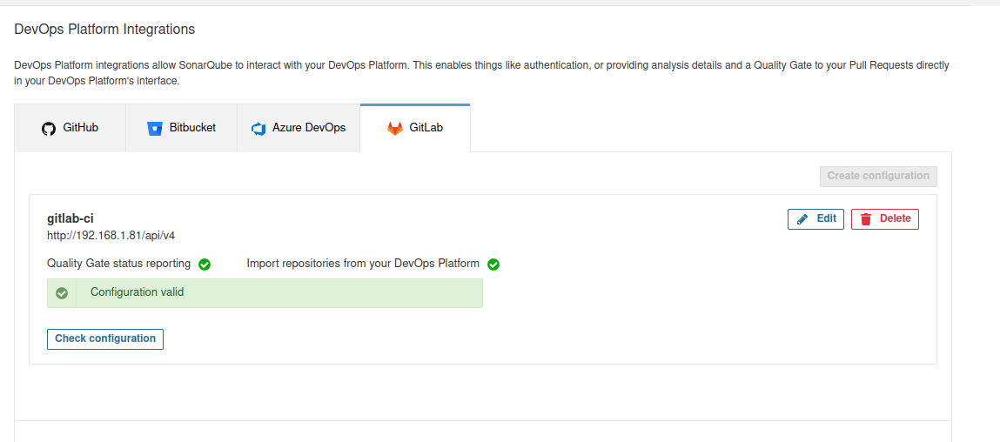

# Sonarqube DE + Gitlab CI (Quality Gate status in GitLab Merge Request) + Jenkins (Webhook , Auto Merge Request, Multi Branch analysis)

## Pre-requirement

-   Sonarqube DE (Local)
-   Gitlab (Local)
-   Jenkins (Local) with plugin gitlab and multi-branches


### Using Gitlab CI

#### Create access token in gitlab
Going to gitlab in Edit Profile (user Setting) > Access Token 

- Token name : **sonarqube-token**
- Expiration date : **Put Empty**
- [ * ] api

Then Create and save the `Token`


#### Create Applications ID in gitlab
Going to User Setting in Gitlab > Application 

name : sonarqube-app-id
Url : http://192.168.1.31:9000/oauth2/callback/gitlab

Then Create and save  `Application ID` , `Secret`

#### Configure Gitlab in Sonarqube
Going to tab Administration > Configuration > DevOps Platform Integration > Gitlab , then Create configure like this :
- Configure name : **gitlab-ci**
- GitLab API URL : **http://192.168.1.81/api/v4**
- Personal Access Token **USE TOKEN WE CREATED BEFORE**


Then setup another configuration in GitLab Authentication :
- Enabled : **True**
- GitLab URL : **http://192.168.1.81**
- Application ID : **USE THE APPLICATION ID WE CREATED BEFORE**
- Secret : **USE THE SECRET WE CREATED BEFORFE**
- Allow users to sign-up : **True**

#### Create project sonarqube
First we need to generate token for gitlab in sonarqube :
Going to My Account > Security > Generate token
Token name : gitlab-token
And save the token for later

Then

Going to Project > Create Project > Gitlab 
```
Note : 
if sonarqube needs a token , use the token we created earlier with the name sonarqube-token
```

Then pick repository and setup > With GitLab CI > Other (for JS,TS,GO.... 
Save ** sonar.projectKey ** 
Then next and setup variable repository gitlab :
- Access gitlab and go to Project > Settings > CI/CD > Variables 
	- Add variable SONAR_HOST_URL : **http://192.168.1.31:9000** , uncheck Protect variable and Mask Variable
	- Add variable SONAR_TOKEN  : **TOKEN gitlab-token** , uncheck Protect variable and Checklist Mask Variable
	
- Copy gitlab-ci.yaml and finish

```yaml
sonarqube-check:
  image: 
    name: sonarsource/sonar-scanner-cli:latest
    entrypoint: [""]
  variables:
    SONAR_USER_HOME: "${CI_PROJECT_DIR}/.sonar"  # Defines the location of the analysis task cache
    GIT_DEPTH: "0"  # Tells git to fetch all the branches of the project, required by the analysis task
  cache:
    key: "${CI_JOB_NAME}"
    paths:
      - .sonar/cache
  script: 
    - sonar-scanner -Dsonar.projectKey=<Your Project Key>
  allow_failure: false
  only:
    - merge_requests
    - master # or the name of your main branch
    - develop # your another branch
  tags:
  	- sonar-test
```
>>Note:
>>First setup gitlab runner in you repository and set the tags of the yaml, then put your project key in the yaml. Make sure project gitlab have 2 branch like master and develop or anything

#### Configure server base url sonarqube
Going to Administration > Configuration > General > Server base URL
![[img12.png]]

#### create quality gate for making pipeline failed 

then change quality gate in project in Project > name-project > Project Settings > quality gate

#### Access gitlab project
Going to Your Project > Repository > Branch develop or anything > New File
- File Name : **.gitlab-ci.yml**
- Paste gitlab-ci.yml we created early
- Commit Changes


Gitlab will trigger when we add .gitlab-ci.yml , Check pipeline jobs in CI/CD > Pipeline > and make sure log doesn't have any error


if pipeline succeed then create merge request from develop into master in Merge requests > new merge requests :


And wait until merge request show quality gate and merge to master :


Then Merge and add any code more than 1 line for making quality gate error , Example : 


Then create merge requests again


Quality gate will failed because we set quality gate to custom before .

### Using Jenkins 

#### Create gitlab api token for jenkins
Access gitlab dashboard > Edit Profile > Access Token 


- Token name : **jenkins-token**
- Expiration date : **Put Empty**
- [ * ] api
Then save the token 

#### Configure Gitlab in jenkins
Access jenkisn dashboard > Manage Jenkins > Configure System > Gitlab > Add Credentials 

Then save

#### Configure Sonarqube server
Access sonarqube > My Account > Security > Generate Token > Generate & Copy

then Access jenkisn dashboard > Manage Jenkins > Configure System >  SonarQube servers and configure like this 
- Name : Sonar_DE
- Server URL : http://192.168.1.31:9000/
- Add secret text from token sonarqube : 
- save


#### Add Jenkinsfile and delete gitlab-ci.yml in all branch
Jenkinsfile:
```yaml
pipeline {
    agent any
   
    stages{
        stage('Sonarqube'){
            steps {
                script{
                    //def scannerHome = tool 'sonar-scanner';
                    withSonarQubeEnv('Sonar_DE') {
                    sh "/jenkins-cli/sonar-scanner/bin/sonar-scanner -Dsonar.projectKey=<Your Project Key> -Dsonar.qualitygate.wait=true"  
                    }  
                }
            }
        }
    }
}
```


#### Creating Multibranch pipeline and Webhook
New Item > Multibranch Pipeline > Ok 
Then Going to Branch Sources > Add source > Gitlab Project and configure like this  :
- Checkout Credentials : 
- Owner : root
- Project : ***Your Gitlab Project name***
- Other Configuration :  
- Then going to `Scan Multibranch Pipeline Triggers`
- Trigger token : `gitlab-token-trigger`
- Access gitlab project > Settings > Webhook  : 
	- URL : http://10.8.60.31:8080/multibranch-webhook-trigger/invoke?token=gitlab-token-trigger
	- Checklist `Push Event`
	- Checklist `Merge request events` 
	- Checklist Enable SSL verfication
- Then save configuration jenkins


#### Check
Going to project Sonar-Test > Status : !
**ipeline will failed because of quality gate, **

Checking develop: 

Checking in sonarqube (Project > name your project > select branch name  ) : 

#### Test Merge Requests
- First we need to edit code , Go to Gitlab > Repository > edit file  
- Then Commit and Go to Gitlab > Project > Merge Requests > New Merge Requests branch develop to master 
- Status Jenkins : 
- Quality Gate in Merge Requests : 

#### Merge will be blocked because pipeline must be succeed : 


# DONE :D
